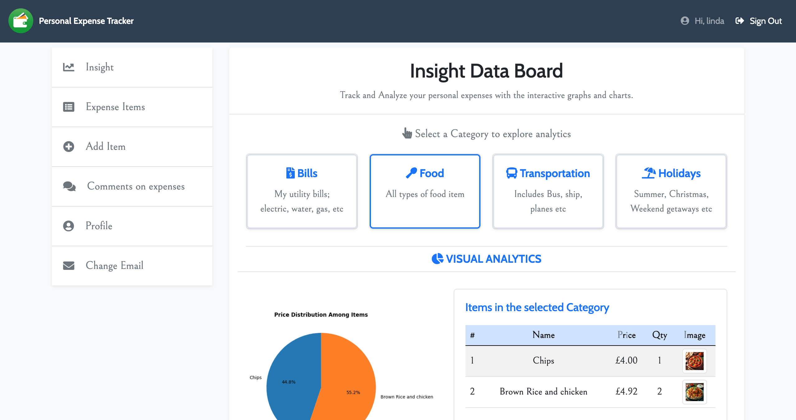

# Personal Expense Tracker

The Personal Expense Tracker is a web application designed to help users manage and track their finances with ease. Users can categorise their expenses, and monitor their spending habits. 

With a simple, intuitive interface and graphical representation of your spendings, this app provides valuable insights into personal finances, helping users make informed decisions and take control of their financial future.

## Table of content

- [User experience (UX)](#user-experience-ux)
    * [Key project goals](#key-project-goals)
    * [Target audience](#target-audience)
    * [User requirement and expectations](#user-requirements-and-expectations)

- [Epics and user stories](#epics-and-user-stories)
  * [Epics](#epics)
  * [User stories](#user-stories)

- [Features](#features)
  * [Logo and navbar](#logo-and-navbar)
  * [Clear indication as to whether the user is logged in or out at all times](#clear-indication-as-to-whether-the-user-is-logged-in-or-out-at-all-times)
  * [Django alert messages](#django-alert-messages)
  * [Call to action button](#call-to-action-button)
  * [User dashboard](#user-dashboard)
  * [Landing page](#landing-page)
  * [Sign form](sign-form)

 

## User experience (UX)

### Key Project goals
- Enable users to record their expenses, and categorise them for easy tracking and analysis.
- Provide graphical representations (pie charts) to help users visualize their spending habits.
- Ensure the app has an intuitive, easy-to-use interface, making financial tracking accessible for everyone, even with no prior experience.
- Build a responsive web application that works seamlessly across all devices
- Create an admin panel to managing expense categories and overall web app

### Target audience
- Users who are interested in tracking their expenses
- Young professionals starting their careers and need help tracking their spending/expenses inorder to safe for the future
- People comfortable with using web applications to track their expenses, and who prefer visual insights (charts, graphs) for better understanding.

### User requirements and expectations
- A web app that works seamlessly across different screen sizes
- An intuitive and easy-to-navigate interface with minimal setup.
- Ability to quickly add items in the categories
- ability to easily Register, log in, and manage their accounts.
- A bility to categorize expenses (e.g., Food, Transportation) for easy tracking
- Ability to add a comment whilst creating items
- Ability to read and have an understanding of what the app does in the about section
- clear and interactive visualizations (like bar or pie charts) of their spending patterns.

## Epics and user stories
### Epics
1. Database and admin set up
2. A fully functional landing page
3. Register/signup form
4. Login page and form
5. Logout page
6. Graphical Representation of expenses in the insight databoard when a category is clicked
7. Previous comments can be seen when adding new comments on expenses.
8. Update, edit and delete expense items 
9. Profile page that contains users details such as username and email address
10. Support Email
11. Social links

### User stories
- As a superuser, I can:
1. perform backend crud operations(part of epic 1)
2. create new Category(part of epic 1)

- As a potential registered user, I can:
3. I can view a clear, concise headline that explains its purpose within the first few seconds of visiting.(part of epic 2)
4. I can view a short introductory section and call-to-action that guides visitors on how to get started or explore the website.(part of epic 2)

- As a website user, I can:
5. Quickly grasp the website's purpose to efficiently navigate and utilize its features.(part of epic 2)
6. Create an account to access the services available to registered members (part of epic 3)
7. Log in to access my account and utilize the full features of the website(part of epic 4)

- As a Logged in web user, I can:
8. Navigate to the 'insight data dashboard' to gain a comprehensive understanding of the app's features and functionality.(part of epic2)
8. Add expense items to the appropriate category(Part of Epic 8)
9. View the graphical representation of my expenses (Part of Epic 6).
10. Edit expense items within the selected category (Part of Epic 8).
11. Add comments(via the insight databoard or comment on expense pgae) to my added or edited items to note important details or reasons for their inclusion or deletion (Part of epic 8)
12. View my profile (part of 9)
13. Log out of the website to securely end my session and protect my account(part of epic 5)

## Features
### Logo and Navbar
The navigation bar and logo are positioned at the top of the page, offering a responsive and user-friendly design. Prioritizing a "mobile-first" approach, the navigation bar features a clickable hamburger icon with a dropdown menu on mobile devices. As the screen size increases (from tablets to laptops and beyond), the hamburger icon disappears, and the navigation bar expands to display options for navigating to different pages, including Registration/Sign Up, Login, and About. Please refer to the screenshots below for visual reference.
#### img for responsiveness mobile/tablet and laptop

#### Mobile navigation using burger menu

#### Larger screen navigation using burger menu

### Clear indication as to whether the user is logged in or out at all times
The base HTML checks whether the user is logged in and displays either "You are logged in as [username]" or "You are not logged in," based on the authentication state.

#### The image below indicates when a user is signed in

#### The image below indicates when a user is signedout

### Django alert messages
For every comment, the user is alerted. for example when a comment is added regarding userss' expense items, either via the the insight databoard or via the comment on expenses page, upon successfully  logs in and when user logs out.

#### Django alert message example 1
The first example is an alert that shows "successfully signed in as username" upon sign in.

#### Django alert message example 2
The second example is an alert that shows 'You have signed out' after the prompt 'Are you sure you want to sign out?'. Once the 'Yes' button is clicked, the alert pops up. See the images below:

#### Django alert message example 3
The third example is an alert that shows 'Comment added successfully.' This pops up when a user adds a comment and clicks 'Save.' See the image below:

### Landing page
This is where users or site visitors are directed when they click the URL/link to the site. It contains a header with the title 'Personal Expense Tracker' and an icon, a sign-in and sign-out navbar, a hero container with the text: 'Ready to track and take full control of your spending? Sign up now and take the first step towards financial management and freedom!' along with a call-to-action button beneath. It also includes brief but detailed information on why to choose our tracker. Additionally, there is a footer containing brief details about the web app, its features, social media icons, and a support email.

### Call to action button
When a visitor accesses the site, a call-to-action button is visible on the landing page. One of the key project goals is to 'build a web app that encourages and directs users to explore the expense tracker.' The button displays the text 'Get Started,' and the user is directed to the sign-in or sign-up page, depending on whether they are an already registered user or a site visitor.

### User dashboard
Upon successful login, users are directed to the insights dashboard, where they can track and analyse their expenses in an interactive graph and table, view previous comments on their expenses, add comments, and create, read, update/edit, and delete expense items. Users can also view their profile.

#### Insight databoard
This board contains different expense categories, a graphical representation of users' expenses, and a comment box where users can share their thoughts or suggest improvements regarding their spending. see images below:

#### Expense items
Here, users can view their already listed expenses with images, they can choose to edit or delete their expenses aswell.

#### Add item
Users can add items, choose the category of the item, add a description, purchase-date, price, quantity and choose to upload image. see below:

#### Comments on expenses
Users can view their previous comments along with the date and time they were created. They can add more comments and select an expense category as well. Once they click 'Save,' the comments are added immediately.

#### Profile
Users can view their profile. The profile page contains the username, email, and the date they registered.

### Footer
This include a little 'about us' information, features, social media icons and an email for support.

### Sign form

#### Sign in form
This is a straightforward form that prompts for a username and password.

#### Sign up form
This is a simple form to register a new user. It includes fields for the username, email, and password. The password must be entered twice for confirmation, and the form also specifies the requirements for an acceptable password.

#### Sign out 
This page asks users if they are sure they want to sign out. It includes a red logout button underneath, and a button that takes the user back to the insights dashboard if they choose to remain logged in.

### Form with CRUD functionality when logged in

